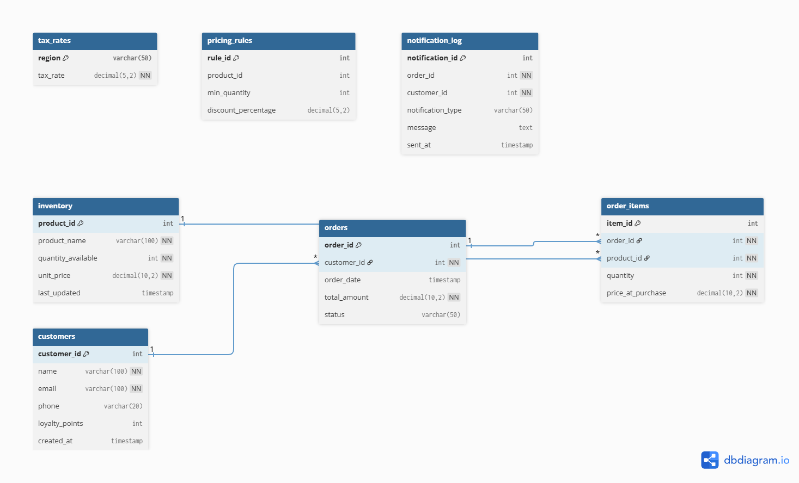

# Nexus Cart 🛒

**NexusCart** is a robust, modular e-commerce backend built using **Service-Oriented Architecture (SOA)**. It decouples core business logic into five autonomous microservices, enabling scalable inventory management, dynamic pricing calculations, and real-time order processing.

---

## 🏗️ Architecture

The system is composed of 5 distinct RESTful microservices that communicate via HTTP JSON payloads:

1. **Order Service (`5001`):** Orchestrates the buying process, transactions, and history.
2. **Inventory Service (`5002`):** Handles stock levels, batch availability checks, and atomic updates.
3. **Pricing Service (`5003`):** Dynamic price calculation engine with support for tax rules and bulk discounts.
4. **Customer Service (`5004`):** Manages user profiles and loyalty point accumulation.
5. **Notification Service (`5005`):** Asynchronous email simulation and activity logging.

---

## 📊 Database Schema

The system uses a unified MySQL database (`ecommerce_system`) to maintain relational integrity while allowing services to manage their specific domains.



---

## 🚀 Getting Started

### Prerequisites

- Python 3.8+
- MySQL Server 8.0
- Postman (for testing)

### 1. Database Setup

1. Open your MySQL Workbench or terminal.
2. Create the schema `ecommerce_system`.
3. Run the provided SQL script to initialize tables and seed data:

```bash
mysql -u root -p ecommerce_system < database/schema.sql
```

### 2. Installation

Install the required Python dependencies:

```bash
py -m venv .venv
.venv\Scripts\activate
pip install flask mysql-connector-python requests
```

### 3. Running the Services

You can start all 5 microservices simultaneously using the provided automation script.

```bash
python backend/order_service.py
python backend/inventory_service.py
python backend/pricing_service.py
python backend/customer_service.py
python backend/notif_service.py
```

---

## 🧪 Testing with Postman

A comprehensive **Postman Collection** is included (`test_suite.postman_collection.json`) to test all endpoints.

**Key Scenarios:**

1. **Shopping Flow:** Browse Inventory → Calculate Batch Price → Create Order.
2. **Loyalty System:** Verify points update in Customer Profile after purchase.
3. **Order History:** Retrieve past orders for a specific customer.

---

## 📂 Project Structure

```text
NexusCart/
├── backend/
│   ├── customer_service.py   # Port 5004
│   ├── inventory_service.py  # Port 5002
│   ├── order_service.py      # Port 5001
│   ├── pricing_service.py    # Port 5003
│   ├── notif_service.py      # Port 5005
│   └── utils.py              # DB Connection Logic
├── database/
│   ├── Database-ERDiagram.png
│   ├── schema.dbml
│   └── schema.sql
├── frontend/
│   ├── src/
│   ├── target/
│   └── pom.xml
├── test-suite.postman_collection.json # Postman Tests
├── requirements.txt
└── README.md
```
